# ETH Gas Live

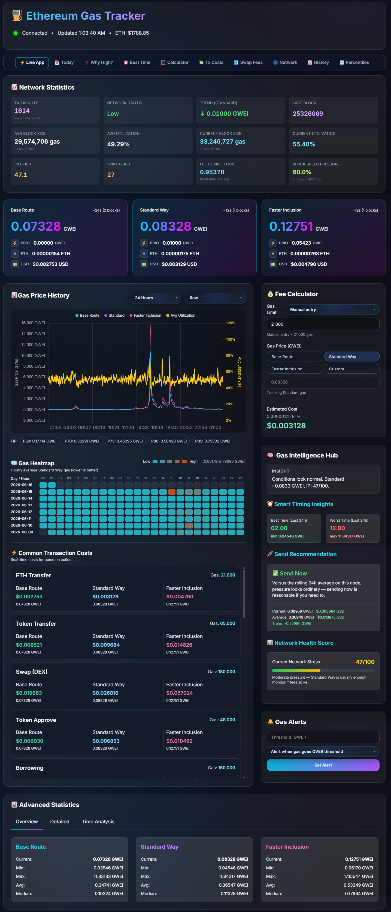

**Live Ethereum gas intelligence** on Logic Encoder — see what a send costs right now, compare three practical send tiers, and decide whether to submit or wait. Open [logicencoder.com/ethereum-gas-tracker/](https://logicencoder.com/ethereum-gas-tracker/) in the browser. Built for senders, swappers, and NFT minters who want more than a wallet’s single high/medium/low guess — especially when timing a transaction around congestion spikes, listing mints, or bridge hops where a few gwei difference is real money at scale.

The header shows **connection status**, **last update time**, and **live ETH/USD** so you know the numbers are fresh. A horizontal **topic nav** links to eleven SEO pages (fees today, best time, calculator, mempool, and more) without leaving the product chrome — each panel loads inside the app shell when you want depth, not a cold navigation to a static article.

## Tech stack

| Layer | Technologies |
|-------|--------------|
| WordPress plugin | PHP, WordPress REST API, shortcodes, wp-admin settings, LiteSpeed cache bypass |
| Public SPA | HTML, CSS, vanilla JavaScript (`gas_tracker.html`), Tailwind CSS, Chart.js |
| Live backend | Python 3, FastAPI, uvicorn, web3.py, aiohttp, websockets, pydantic, orjson |
| SEO SSR | Node.js, Express (`ssr-server.js`) |
| Data | WordPress MySQL (options/transients), SQLite (gas history on backend) |
| Realtime | WebSocket (`/ws/gas`), REST push ingest with API key, REST mirror on WordPress |
| Networking | Cloudflare tunnel, Ethereum JSON-RPC / mempool feeds |
| Hosting | WordPress on shared hosting; Python and Node on self-hosted Linux servers |

## Live dashboard

The main app is a full-screen **gas tracker** with the **Live App** as home base. Data refreshes over **WebSocket** when the browser can connect; if a corporate network blocks WS, REST polling plus the WordPress transient mirror still updates headline tiers every few seconds. The page title and favicon react to current Standard gwei so a pinned tab doubles as an at-a-glance fee indicator.

### Three send tiers

Ethereum post-EIP-1559 pricing is not one number — senders trade off cost vs inclusion speed. The product surfaces **three named tiers** instead of opaque wallet labels:

| Tier | Role |
|------|------|
| **Base Route** | Lowest practical fee — targets economical sends when the network is calm and you can wait an extra block or two. |
| **Standard Way** | Balanced default — the tier most users should compare against wallet “medium” estimates. |
| **Faster Inclusion** | Priority-heavy path when mempools are busy, NFT mints are competitive, or you need the next block. |

Each card shows **gwei** (base + priority breakdown), **ETH and USD estimates** for a reference transfer, and a plain-language **confirmation hint** (“~1 block”, “may take several blocks”, etc.). Cards pulse-update on every WebSocket tick so you watch fees move during a congestion spike without refreshing.

When Standard is elevated vs its rolling average, the UI nudges you toward wait-or-send guidance in the Intelligence Hub (below) rather than leaving you to guess from a single red number.

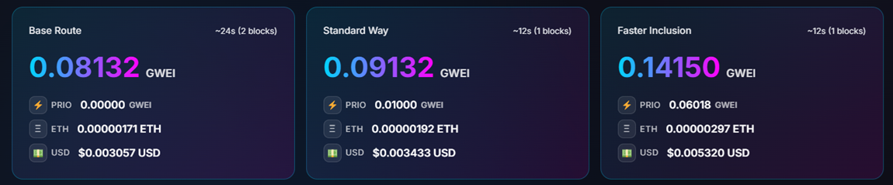

### Network statistics

Above the tier cards, a **network statistics grid** answers *why* fees moved — not only *what* they are. Metrics include:

- **Tx / minute** — estimated from recent blocks; primary activity signal when mempool depth is noisy.
- **Network status** — Normal / Elevated / High / Spike labels derived from backend stress scoring.
- **Trend (Standard)** — short-term direction vs the last hour so you see fees climbing before they peak.
- **Last block** — anchor for staleness checks.
- **Avg / current block size and utilization** — how full blocks are; high utilization usually means higher competition for space.
- **IPI (Inclusion Pressure Index) 0–100** — single stress score aligned with the Intelligence Hub.
- **SPIKE score** and **fee competition** — how aggressive other senders are right now.
- **Block speed pressure** — whether blocks are arriving faster or slower than target, affecting queue drain rate.

Use this panel when Standard jumped but you are unsure if it is a blip (one fat block) or sustained load (climbing tx/min + high utilization).

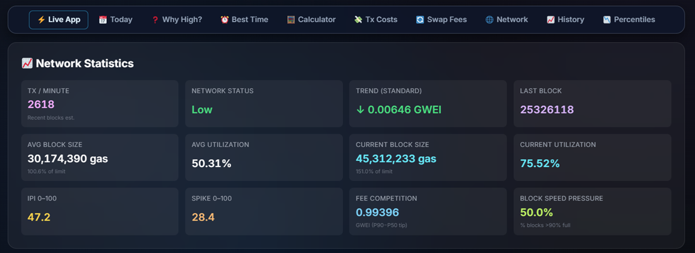

### Gas Intelligence Hub

Not everyone wants to read four charts before sending. The **Gas Intelligence Hub** compresses backend insight into one glass panel:

- **Send / wait sentence** — plain language when fees are above or below recent norms (“good time to send” vs “consider waiting”).
- **Best time (last 24h)** — cheapest hour window already observed today.
- **Worst time (last 24h)** — hour to avoid if you can defer.
- **Network health score** — 0–100 summary for mobile readers who only have screen space for one badge.

The hub recomputes on every payload tick using the same **IPI** scale as the network grid, so guidance stays consistent across panels.

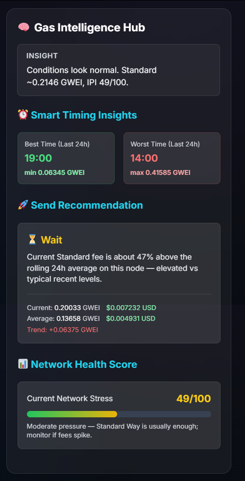

### Fee calculator

The **fee calculator** answers “how much will *my* transaction cost?” — not just the reference transfer on the tier cards.

- **Gas limit presets** — ETH transfer, ERC-20 transfer, DEX swap, NFT mint, bridge deposit, and more; or type a custom limit if you know units from a contract simulation.
- **Tier selector** — price from Base, Standard, Faster, or **custom gwei** for what-if scenarios.
- **Live output** — instant ETH and USD fee estimate; tracks Standard automatically when you pick a tier.

Power users cross-check wallet simulation quotes; newcomers use presets so they do not have to know that a swap is ~180k gas.

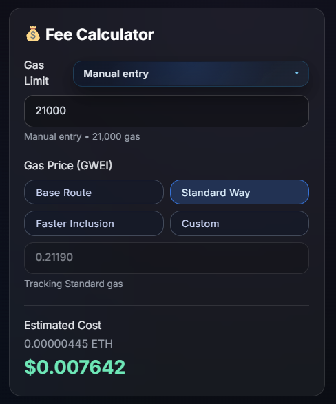

### Common transaction costs

The **featured transaction costs** grid shows real-time estimates for ~18 action types at **all three tiers** side by side — ETH transfer, token transfer, DEX swap, bridge, NFT mint, approval, and more.

Each row is ETH + USD at Base / Standard / Faster so you compare “cheap send now” vs “pay for speed” on the *same action*. Useful when planning multi-step workflows (approve + swap + bridge) where you only care about total dollars, not gwei math.

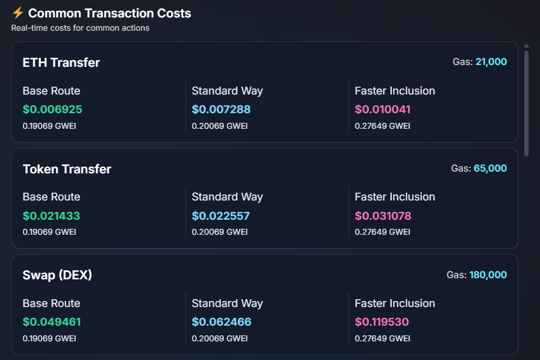

### Gas price history

The **history chart** plots **Base Route**, **Standard**, and **Faster Inclusion** over selectable ranges — **1h, 6h, 24h, 7d, 14d, 30d**. A secondary axis overlays **average block utilization** so you correlate fee spikes with full blocks.

**Faster-tier percentile band** (P10 / P90) shows how volatile the priority market is — wide band means tips swing wildly block to block. FIP percentile readouts in the chart footer tie back to the Percentiles SEO page for search landings.

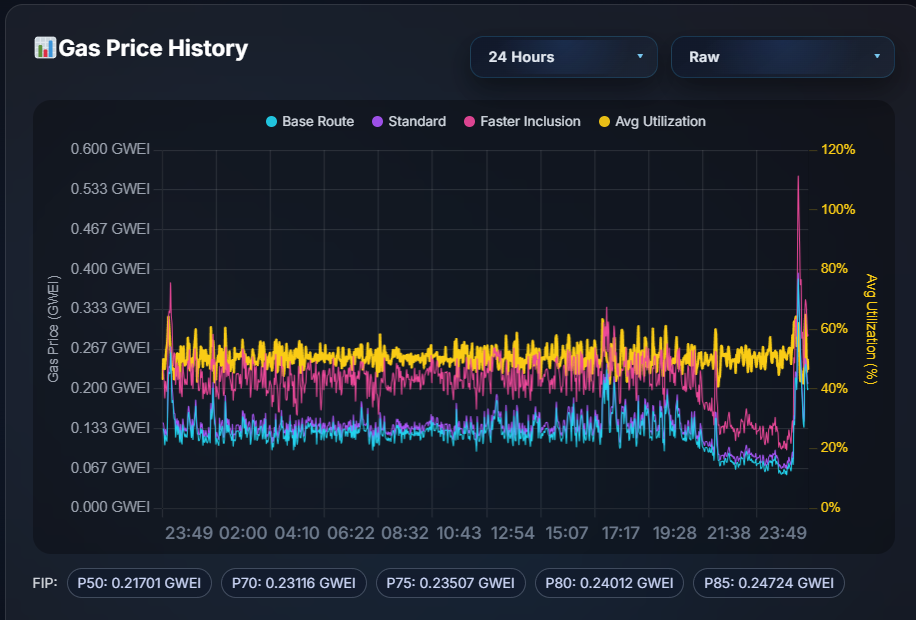

### Gas heatmap

The **heatmap** colors **hourly average Standard Way gas** over the last **eight days**. Darker cells = cheaper hours; bright cells = expensive windows.

Hours shift to **your browser timezone** — a European evening cheap window displays in local time, not UTC. Use it to schedule non-urgent sends (treasury payouts, batch claims) without setting a 3 a.m. alarm manually.

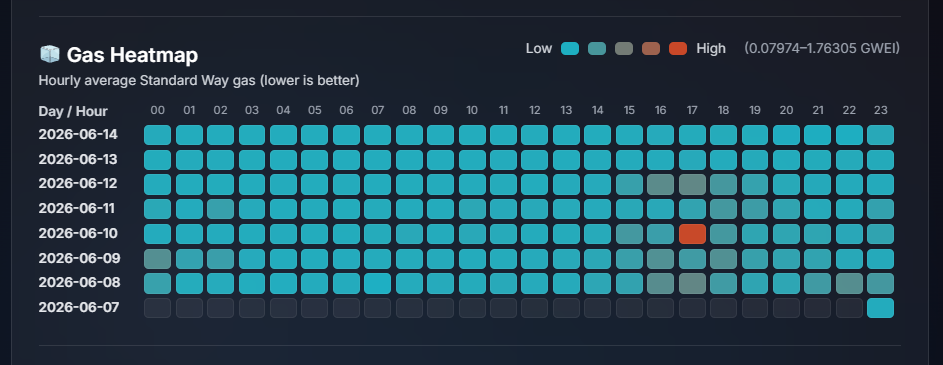

### Advanced statistics

Three in-app sub-tabs for researchers who want tables, not only charts:

**Overview** — current, min, max, average, and median gwei per tier for the selected history window. Quick answer to “how bad was today vs the week?”

**Detailed** — percentile breakdowns (P10/P50/P90), base fee stats, live tx throughput, sample quality indicators, and **IPI** history snippets. Use when writing up network conditions or verifying a spike was real in the data.

**Time Analysis** — best and worst hour plus a full **hourly averages** table for the period. Pairs with the heatmap for exact numbers behind the colors.

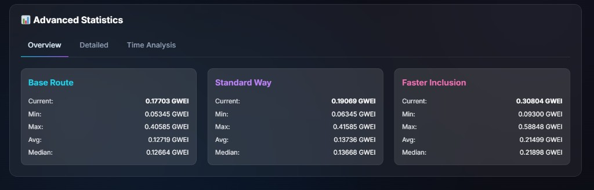

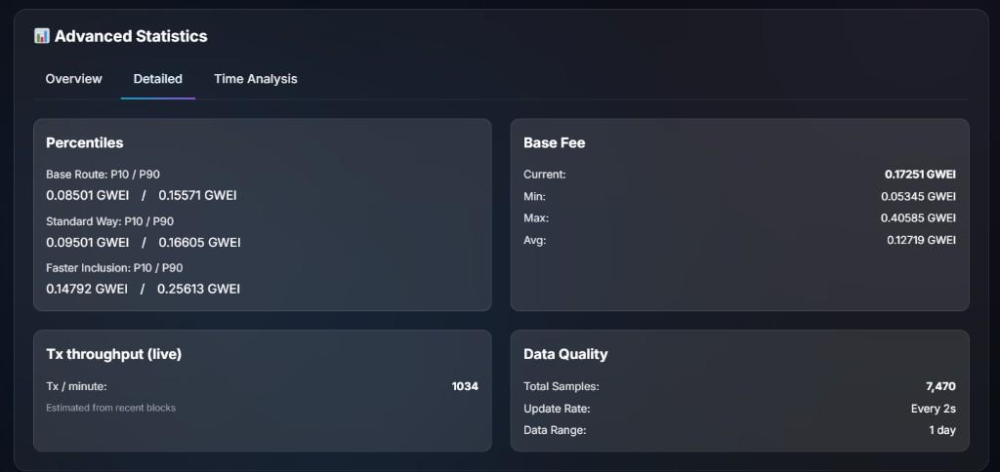

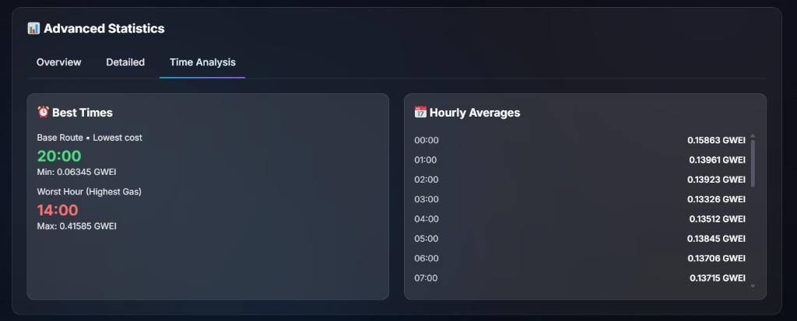

### Custom alerts

Set a **gwei threshold** above or below Standard and optionally enable **browser notifications**. Alerts persist per browser session so overnight fee drops ping you without keeping the tab focused — handy for “notify me when fees drop below my target” workflows. Backend stores alert rows; the UI shows active rules and last trigger time.

## SEO topic pages

Eleven indexable URLs on logicencoder.com are filled with **real-time data**, not static marketing copy. Each targets a search intent and links back to the main tracker:

| Page | URL | Intent |
|------|-----|--------|
| Fees today | [ethereum-gas-fees-today](https://logicencoder.com/ethereum-gas-fees-today/) | “What do fees look like right now?” |
| Why fees high | [why-are-ethereum-gas-fees-high](https://logicencoder.com/why-are-ethereum-gas-fees-high/) | Explainers during spikes |
| Best time | [best-time-to-send-ethereum](https://logicencoder.com/best-time-to-send-ethereum/) | Scheduling sends |
| Calculator | [ethereum-gas-calculator](https://logicencoder.com/ethereum-gas-calculator/) | Landings for “gas calculator” queries |
| Tx costs | [ethereum-transaction-costs](https://logicencoder.com/ethereum-transaction-costs/) | Per-action comparisons |
| Swap gas | [ethereum-swap-gas-fees](https://logicencoder.com/ethereum-swap-gas-fees/) | DeFi-specific |
| Mempool | [ethereum-mempool-tracker](https://logicencoder.com/ethereum-mempool-tracker/) | Queue / load context |
| Network status | [ethereum-network-status](https://logicencoder.com/ethereum-network-status/) | Health dashboard for search |
| History | [ethereum-gas-price-history](https://logicencoder.com/ethereum-gas-price-history/) | Long-range charts |
| Percentiles | [ethereum-gas-percentiles](https://logicencoder.com/ethereum-gas-percentiles/) | Statistical deep dive |

**Embed mode** (`?gt_embed=1`) serves a chromeless view for in-app panels and third-party iframes without WordPress theme chrome.

## WordPress embedding

Shortcode **`[eth_gas_dashboard]`** drops the same dashboard shell into any WordPress page or post. The plugin handles routing, **LiteSpeed / full-page cache bypass** (stale gwei on cached HTML is unacceptable), and a REST mirror of the latest payload — **gas math runs on the backend**, not in PHP.

Editors embed the live tool inside articles (“check fees below”) without maintaining a separate iframe host.

## Site operator tools

wp-admin **ETH Gas Live** includes **Mission Control** — production observability without SSH.

**Runtime card** — backend uptime, host/port, ingest loop timing (last/avg/max ms), last error string. Loop spikes often precede stale public data.

**WebSocket card** — current and max connected clients, total connect/disconnect lifetime counts, messages per minute, broadcast failure counter. If failures climb while clients are high, check network or payload size.

**Fetch + Push card** — RPC fetch success rate, fetch latency (last/avg/max), WordPress push status and latency. Confirms the Python → WordPress mirror path that keeps REST fallback fresh.

**Database + Cache card** — gas history row count, alert row count, SQLite file sizes (DB/WAL/SHM), history and heatmap cache hit ratios. Low hit ratio after deploy may mean cold cache, not broken ingest.

Three rolling **charts** plot loop cycle ms, fetch latency ms, and WS client count. Expandable **raw monitoring JSON** for copying into tickets. **WordPress cache mirror** footer shows last push timestamp and cached payload key count.

Settings above Mission Control configure API base URL, WebSocket URL, SSR base, push API key, and refresh interval — change endpoints after infra moves without editing code.

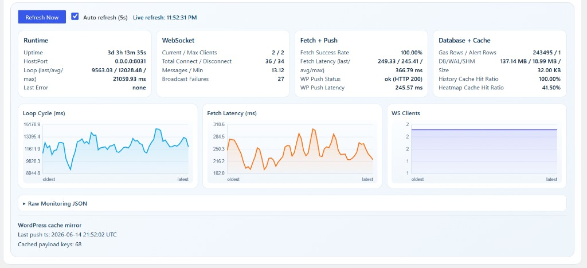

Private code: [eth-gas-live-plugin](https://github.com/logicencoder/eth-gas-live-plugin) · live data [eth-gas-live-backend](https://github.com/logicencoder/eth-gas-live-backend)

See [REPOS.md](REPOS.md).

---

**Made by [Logic Encoder](https://logicencoder.com)** · [GitHub](https://github.com/logicencoder) · [Contact](https://logicencoder.com/contact/)
