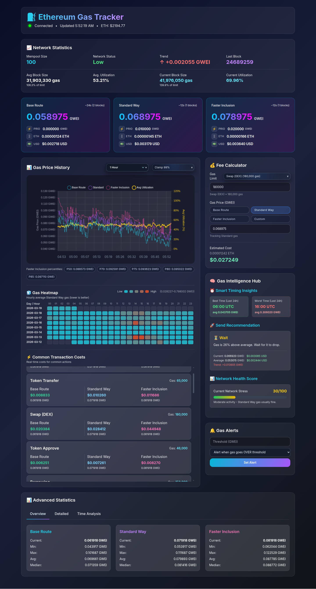

# ETH Gas Live

**Live Ethereum gas intelligence** on Logic Encoder — see what a send costs right now, compare three practical send tiers, and decide whether to submit or wait. Open [logicencoder.com/ethereum-gas-tracker/](https://logicencoder.com/ethereum-gas-tracker/) in the browser. Built for senders, swappers, and NFT minters who want more than a wallet’s single high/medium/low guess — especially when timing a transaction around congestion spikes.

## Tech stack

| Layer | Technologies |
|-------|--------------|
| WordPress plugin | PHP, WordPress REST API, shortcodes, wp-admin settings, LiteSpeed cache bypass |
| Public SPA | HTML, CSS, vanilla JavaScript (`gas_tracker.html`), Tailwind CSS, Chart.js |
| Live backend | Python 3, FastAPI, uvicorn, web3.py, aiohttp, websockets, pydantic, orjson |
| SEO SSR | Node.js, Express (`ssr-server.js`) |
| Data | WordPress MySQL (options/transients), SQLite (gas history on backend) |
| Realtime | WebSocket (`/ws/gas`), REST push ingest with API key, REST mirror on WordPress |
| Networking | Cloudflare tunnel, Ethereum JSON-RPC / mempool feeds |
| Hosting | WordPress on shared hosting; Python and Node on self-hosted Linux servers |

## Live dashboard

The main app is a full-screen **gas tracker**:

- **Three send tiers** — Base Route, Standard Way, Faster Inclusion — each with gwei, priority component, ETH and USD estimates, and a plain-language confirmation hint.
- **Network context** — transactions per minute, congestion status, block utilization, fee competition, and spike indicators so you see *why* fees moved, not only the number.
- **History charts** — selectable ranges (1h through 30d) for all tiers.
- **Heatmap** — fee intensity by hour, shifted to your local timezone in the browser.
- **Featured action costs** — estimated fees for common operations (swaps, approvals, NFT mints, etc.) in one scrollable list.
- **Fee calculator** — enter gas units and get tier costs instantly.
- **Send / wait guidance** — short prediction panel when waiting might save money.
- **Gas Intelligence Hub** — nine topic tabs (fees today, best time to send, mempool, history, percentiles, and more) inside the same shell.

Data refreshes over **WebSocket** when available, with REST fallback so the page stays usable on strict networks.

## SEO topic pages

Eleven indexable URLs on logicencoder.com are filled with **real-time SSR data**, not static marketing copy. Examples:

- [Ethereum gas fees today](https://logicencoder.com/ethereum-gas-fees-today/)
- [Best time to send Ethereum](https://logicencoder.com/best-time-to-send-ethereum/)
- [Ethereum gas calculator](https://logicencoder.com/ethereum-gas-calculator/)
- [Ethereum mempool tracker](https://logicencoder.com/ethereum-mempool-tracker/)
- [Ethereum network status](https://logicencoder.com/ethereum-network-status/)

Each page targets a specific search intent while linking back to the main tracker. Embed mode (`?gt_embed=1`) serves a chromeless view for in-app panels.

## WordPress embedding

Shortcode **`[eth_gas_dashboard]`** drops the same dashboard shell into any WordPress page. The plugin handles routing, cache-friendly delivery, and a REST mirror of the latest payload — **gas math runs on the backend**, not in PHP.

## Site operator tools

wp-admin **ETH Gas Live** includes Mission Control: backend health (WebSocket clients, fetch/push stats, database/cache indicators), configurable API base URL, WebSocket URL, SSR base, push key, and refresh interval — so operators can confirm the live site is fed without touching code.

Private code: [eth-gas-live-plugin](https://github.com/logicencoder/eth-gas-live-plugin) · live data [eth-gas-live-backend](https://github.com/logicencoder/eth-gas-live-backend)

See [REPOS.md](REPOS.md).

---

**Made by [Logic Encoder](https://logicencoder.com)** · [GitHub](https://github.com/logicencoder) · [Contact](https://logicencoder.com/contact/)
